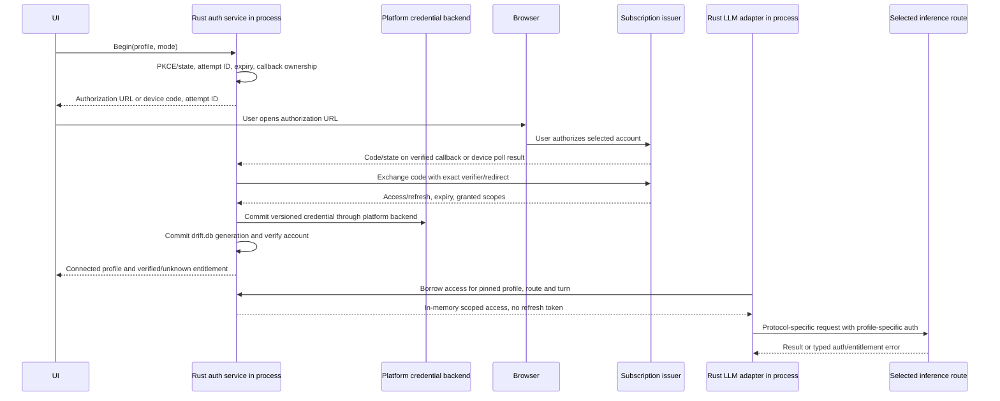

# Native provider authentication for Drift

Research snapshot: 2026-09-29. This is a design and evidence record, not an implementation. Product requirement: Drift owns every access mode, including ChatGPT/Codex subscriptions, Claude subscriptions, direct API keys, gateways and local endpoints. The current Anthropic npm plugin must leave the runtime. SuperGrok subscription and remote MCP authorization also need owned paths. No login, credential-file inspection, inference request, or quota request was performed. The existing provider protocol analysis is in [provider-contracts.md](provider-contracts.md); the migration and storage inventory is in [opencode-exit-inventory.md](opencode-exit-inventory.md). In particular, neither an API key nor a retail subscription implies the other's entitlement.

## Evidence and the decision it supports

Evidence labels below: **Official** means provider or MCP public documentation, **Observed** means the exact published package, checked-out code, or hashed binary, and **Proposed** means a Drift design. A published plugin's working assumptions and a first-party application's private API are not an authorization for a new OAuth client. The requirement to support subscription paths stands; the compatibility and access-policy questions below are release blockers for those paths, not reasons to substitute paid API traffic silently.

| Access profile | Credential and inference destination | Evidence and contract status |
| --- | --- | --- |
| Claude direct API | Anthropic API key, `x-api-key`, `anthropic-version`, `https://api.anthropic.com/v1/messages` | Official Messages API [A2]. Workspaces may require `anthropic-workspace-id`; profile attribution is a separate beta, not the subscription profile. |
| Claude Pro/Max subscription | OAuth authorization-code PKCE, bearer and `oauth-2025-04-20` beta to Messages; current plugin appends `?beta=true` | Observed package [P1-P4]. Claude Code officially offers claude.ai subscription login [A1], but public Messages docs do not grant arbitrary third-party clients this flow. The plugin claims a Claude Code identity and version. Drift must establish an allowed, stable first-party or partner-compatible access path before treating this as production-supported. |
| Claude Console | Console OAuth can create an API key in the plugin; Claude Code now also documents a keyless Console profile on newer versions | Observed [P2][P4], Official [A1]. Console login, generated API key, keyless Console profile and claude.ai subscription are four different states. Creating an API key is API billing, not a subscription token. |
| ChatGPT/Codex subscription | OpenCode's OAuth bearer plus `ChatGPT-Account-Id` to `https://chatgpt.com/backend-api/codex/responses` | Observed [L1]. OpenAI officially documents Codex sign-in with ChatGPT, including browser and beta device-code login [O1]; it does not document this backend as a general third-party Responses API. |
| OpenAI direct API | Platform API key bearer to `https://api.openai.com/v1/responses`; optionally `OpenAI-Organization` and `OpenAI-Project` | Official [O2]. Platform billing and project permissions differ from ChatGPT workspace entitlements [O1]. |
| SuperGrok subscription | Device OAuth bearer in checked-out plugin, currently injected into xAI-bound SDK requests | Observed [L2]. xAI's official API quickstart instead starts with a console API key [X1]. Whether this OAuth token may call each model, endpoint and hosted tool needs confirmation. |
| xAI direct API | xAI console key as bearer to `https://api.x.ai/v1/responses` | Official [X1][X2]. |
| Gateway or local endpoint | Profile-declared protocol, URL, credential type, header map and trust configuration; some endpoints have no credential | Official Codex custom providers can use OpenAI auth, env key or none [O1]; Claude documents separately hosted gateways with SSO and an upstream credential [A3]. Neither implies that a subscription bearer can be sent to an arbitrary gateway. |
| Remote MCP | OAuth for the MCP *resource*, not for a model provider | Official MCP transport authorization [M1]. STDIO MCP normally obtains its own credentials via the child environment. |

## Exact observed login and routing behavior

### Anthropic plugin 1.8.5

Drift pins `@ex-machina/opencode-anthropic-auth@1.8.5` in `engine/opencode/opencode.json:2-4`. The package was read from the official npm tarball `https://registry.npmjs.org/@ex-machina/opencode-anthropic-auth/-/opencode-anthropic-auth-1.8.5.tgz`, 19,997 packed bytes, SHA-1 `da8bedf9643c26b7fe137abc163cba513d84d255`, registry integrity `sha512-3a+HYVCBG1YgKms/Vk+mVpXVXzKlokdYBuTmkEh6AP4WL9f60rTfbVBdtMcbIvvPkqhpgF7mrMc24BXR8B3p1Q==`, 17 files, 69,200 unpacked bytes [P0]. These are *public package* identifiers and integrity values, not credentials. The distribution contains compiled JS and declarations, not its TypeScript source. Citations to `dist/` are to that artifact. No installed settings or token files were opened.

`dist/constants.js:1-19` publishes OAuth client ID `9d1c250a-e61b-44d9-88ed-5944d1962f5e`, claude.ai `/oauth/authorize` for `max`, platform.claude.com `/oauth/authorize` for `console`, `https://platform.claude.com/oauth/code/callback` for the manual-code redirect, and `https://platform.claude.com/v1/oauth/token`. It requests `org:create_api_key user:profile user:inference user:sessions:claude_code user:mcp_servers user:file_upload`. These are public identifiers and requested scopes, not a credential or a guarantee that Drift may register/use this client. `dist/pkce.js:1-15` makes 64 random bytes, base64url verifier and SHA-256 challenge. `dist/auth.js:3-92` generates random UUID-derived state, requests `response_type=code`, `code=true`, `code_challenge_method=S256`, asks for a pasted callback URL or `code#state` or query string, verifies returned state, then JSON-POSTs `authorization_code`, code, state, redirect URI, client ID and verifier to the token URL. There is no device grant in this package. The `Create an API Key` option calls `https://api.anthropic.com/api/oauth/claude_cli/create_api_key` after the Console OAuth exchange, then stores the returned raw key (`dist/index.js`, `methods`). This must remain distinct from Pro/Max subscription login.

`dist/index.js` loader checks `auth.type === 'oauth'`, replaces displayed model costs with zero, and shares one in-flight refresh *per loaded provider instance*. When expired, it re-reads auth and JSON-POSTs `grant_type=refresh_token`, refresh token and client ID to the token URL, with two retries for 5xx/network failures and backoff. It stores the new access/refresh pair through `client.auth.set`, then sends the request. There is no durable interprocess lock or compare-and-swap; a stale second instance can replay an already rotated refresh token. Its refresh code assumes the reply includes a new `refresh_token` and `expires_in`; a missing field can corrupt stored credentials. It has no deliberate `invalid_grant` recovery other than failing the request [P4]. The package README explicitly disclaims guarantees; it is not an Anthropic specification [P5].

The subscription request is materially different from an API-key request. `dist/transform.js:260-309,348-385,477-580` removes `x-api-key`, sets `Authorization: Bearer`, merges `oauth-2025-04-20` and `interleaved-thinking-2025-05-14` into `anthropic-beta`, sends `claude-cli/<reported-version> (external, cli)` as User-Agent, and appends `beta=true` to `/v1/messages`. It can replace the origin with `ANTHROPIC_BASE_URL`, and its insecure option disables TLS verification only with that override. Its body transformer inserts a synthetic `x-anthropic-billing-header: cc_version=...; cc_entrypoint=sdk-cli; cch=...;` text block *inside system content*, ahead of a Claude Agent SDK identity claim; `dist/cch.js:4-47` derives `cch` from the first user text and version suffix from sampled characters. This is neither a documented public header contract nor something to invent for Drift. It strips OpenCode identity paragraphs and specific URL anchors, rewrites one environment sentence and a phrase, and converts tool definitions and historical `tool_use.name` to `mcp_` plus capitalized names. It reverses `name` fields in JSON/SSE responses (`dist/transform.js:206-222,285-315,387-495,497-580`). The SSE path buffers complete lines across network chunks, but a transformed name encoded differently or split across logical SSE lines can escape its regex; the JSON stream transforms *any* qualifying `name` string, not just a validated tool-use path. Synthetic naming can collide with already-prefixed user tools and signed history. The plugin's comments claim prompt fingerprint rejection and version gating, but no provider-public guarantee or independent paid test confirms their stability [P3]. Treat these as brittle compatibility tactics and an identity/access-policy engineering risk. Do not transplant an impersonation marker as the definition of native support, and do not claim a legal violation without an authoritative decision.

### Claude Code 2.1.85 executable

Static Latin-1 reads of `C:\Users\KylePelham\.local\bin\claude.exe` verified SHA-256 `4a336dc188dc44289c801a33ba1868fa2b2b39d345e9a3316327218048c91669`; numeric offsets below are zero-based **byte** offsets for this exact 237,718,176-byte executable. No binary was run. The first compiled JS source region `[120866728,133121000)` parses with TypeScript with zero parse diagnostics; the structural function/callsite index at `C:\Users\KYLEPE~1\AppData\Local\Temp\opencode\drift-claude-ast-index.json` records source SHA-256 `a96b01820b7d0036d1d0bf31563cf5d368f586f62f7d655339fbcdd9cadf43d9`, 52,943 functions and 3,302,825 AST nodes. The second bundle is a duplicate; offsets here refer to the first. `F$`, `zj`, `UJ8` and `CT6` are top-level bindings in that region, so their declarations and callsites can be traced without matching an unrelated dependency's same-named function. These constants describe a compiled client, not a registration for Drift [B1].

| Byte offset | Observed behavior | Limit of inference |
| --- | --- | --- |
| `121619700-121622700` | `Y4` initializes `zZ$`, the production config returned by `F$` (`121620873-121621716`). Production client ID is `9d1c250a-e61b-44d9-88ed-5944d1962f5e`, the *same public ID* shipped in plugin 1.8.5. Production API origin `https://api.anthropic.com`, Console authorization `https://platform.claude.com/oauth/authorize`, claude.ai authorization `https://claude.com/cai/oauth/authorize`, token `https://platform.claude.com/v1/oauth/token`, manual redirect `https://platform.claude.com/oauth/code/callback`, API-key creation `https://api.anthropic.com/api/oauth/claude_cli/create_api_key`, roles `/api/oauth/claude_cli/roles`, MCP proxy `https://mcp-proxy.anthropic.com/v1/mcp/{server_id}`. | Plugin uses `https://claude.ai/oauth/authorize` for its `max` option, *not* the first-party 2.1.85 URL. Matching public client IDs neither establishes identical routing nor permission to ship a new client. |
| `121621716-121622700` | `sy=user:inference`, `e4H=user:profile`, `AZ$=[org:create_api_key,user:profile]`, `n18=[user:profile,user:inference,user:sessions:claude_code,user:mcp_servers,user:file_upload]`, `C76=union(AZ$,n18)` in that order. `HP=oauth-2025-04-20`. | A normal authorization requests `C76`; `inferenceOnly` requests just `sy`. `CFH` defaults to `n18` on refresh, not the full authorization union, unless supplied a different existing scope set. Requested and granted scopes can differ. |
| `123636428-123637854`, `127500200-127505600` | `UJ8` chooses `F$().CLAUDE_AI_AUTHORIZE_URL` or `CONSOLE_AUTHORIZE_URL`; code flow uses `code=true`, client ID, `response_type=code`, localhost ephemeral-port `/callback` or manual redirect, S256 challenge and random state. Optional `orgUUID`, `login_hint`, `login_method`. `br` generates a 32-byte base64url verifier and state, not the plugin's 64-byte verifier/UUID state; it exchanges a matching callback with `PL6`, 15s timeout, fetches profile, then redirects the pending browser response. `FU6` binds `localhost` port zero and checks callback path/state. | The binary has both automatic loopback and manual-code paths. The inspected first-party login path uses authorization code, not a device grant. Its redirect success follows exchange/profile retrieval, although later durable save is a separate step. |
| `123637854-123640000` | `CFH` JSON-POSTs `refresh_token`, `client_id`, scope string; on success it uses returned refresh token or retains old one, computes expiry, parses returned scopes and optionally fetches profile. `FJ8` maps `organization_type` to max, pro, team, enterprise; `wg` at `123635826` GETs `${BASE_API_URL}/api/oauth/profile` with bearer. | `organization_type` and tier are profile evidence, not a promise that any specific model is enabled. |
| `123769116-123770594` | `MGH` saves only claude.ai-scope renewable tokens to credential backend `claudeAiOauth`; inference-only tokens do not become a normal subscription login. `HR` at `123758630` distinguishes API key/helper, OAuth env/fd and claude.ai sources. | Storage backend implementation and live profile were not inspected. |
| `121768650-121773809`, `123770594-123772022` | `zj` resolves through `Lf6().lock` to a bundled `proper-lockfile`-style directory lock. The target is `d6()`, the normalized `CLAUDE_CONFIG_DIR` or `~/.claude` (`120913939`); default lock path is `<target>.lock`, not `.credentials.json.lock`. Lock acquisition uses atomic `mkdir`, `stat` of the lock directory, and stale cleanup by `rmdir`. Default stale threshold is 10,000 ms, floored to 2,000 ms; mtime update defaults to half the stale interval, bounded below by 1,000 ms. A timed, unref'd updater checks mtime ownership and invokes `onCompromised` (default throws) if another writer changes it. Release clears the timer and removes the lock directory; a process-exit handler attempts synchronous cleanup of held locks. `Yz` single-flights normal in-process refresh; `CT6` uses 300,000 ms expiry skew (`Dg` at `123640380`), retries `ELOCKED` five times with 1-2s jitter, re-reads credentials before and after acquiring the lock, persists the rotated pair and releases in `finally`. | A crash leaves the directory until another process judges it stale. A pause over 10s or compromised mtime can invalidate ownership. There is no durable generation CAS or fencing at the issuer; a lock plus rereads reduces races but does not settle an ambiguous refresh response or prove exactly one refresh across crashes. |
| `123769916-123770377`, `126954323-126955200`, `127450323-127451000` | On 401, `VS` coalesces attempts by failed access token. `XZ4` invalidates cached credentials, re-reads the stored token, and succeeds if another process already replaced it; otherwise calls `Yz(0,true)`. The API retry loop `jy8` recreates its client on 401 and calls `VS` when an OAuth access token exists; the claude.ai MCP proxy fetch wrapper also retries once after `VS`/token change. | A subtle first-party gap: `CT6` skips the *pre-lock* expiry checks for `Yz(0,true)` but still checks `Dg(Y.expiresAt)` *after* lock (`123771500`). A 401 with an unexpired but revoked access token may therefore fail to refresh if the stored token has not changed. `CT6` also calls `MGH(A)` but returns true without checking its `{success:false}` save result (`123771657-123771748`). Neither behavior belongs in Drift's contract. Higher-level retries do not authorize replay of partial output or side-effecting tools. |
| `126773278`, `126776723` | First-party error classifier separates revoked OAuth token and OAuth-disallowed organization from generic 401/403; also separates invalid model and API-key errors. | Those message strings may change; use status plus typed body, not English-only matching. |
| `128677256` | First-party usage path GETs `${BASE_API_URL}/api/oauth/usage` with beta/auth assembled elsewhere. | Current Drift host independently uses this path; response shape can drift. |

`F$` always selects the compiled production config here because `YZ$()` returns `"prod"`; `J37` staging is undefined. It also has a local-only `Z37` branch that is unreachable without changing that selector. `CLAUDE_CODE_CUSTOM_OAUTH_URL` can replace the OAuth origin only if its normalized value is one of three compiled allowlisted hosts: `https://beacon.claude-ai.staging.ant.dev`, `https://claude.fedstart.com`, or `https://claude-staging.fedstart.com`. `CLAUDE_CODE_OAUTH_CLIENT_ID` can override the public client ID. Those environment branches are compiled behavior, not evidence that arbitrary third-party OAuth issuers work. Separately, `IE` at `123612362-123615365` constructs the inference SDK with `authToken` from claude.ai OAuth when `g$()` holds, or an API key otherwise; `ANTHROPIC_AUTH_TOKEN`, custom headers and `ANTHROPIC_BASE_URL` have their own precedence. Bedrock, Vertex and Foundry select separate constructors and credentials. The SDK beta method uses `/v1/messages?beta=true` at `120971174`, independent of the plugin's URL rewrite. Do not conflate OAuth issuer override with inference base URL or cloud gateway authentication [B1].

The comparison also sharpens the identity question. The binary's request client uses `x-app: cli` and `claude-cli/2.1.85 (external, <entrypoint>...)` (`123612362`, `122879177`); its first-party system builder uses model/session-dependent Claude identities and an attribution block. At `123790420-123791000`, attribution is gated by `CLAUDE_CODE_ATTRIBUTION_HEADER` and `tengu_attribution_header` (default true), builds `cc_version=2.1.85.<suffix>`, `cc_entrypoint` from environment (default `unknown`), and `cch=00000`; the query path calls `kpq`/`YG8` at `131615825-131616058`. Plugin 1.8.5 instead advertises version `2.1.280`, fixes `sdk-cli`, and derives `cch` as five hex digits from the first user message. Its `mcp_` plus PascalCase transformation differs from the binary's native MCP naming such as `mcp__<server>__<tool>` at `122784256`. Similar intent is not wire equivalence, and a newer reported version is not proof of model entitlement [B1][P1][P3].

Claude Code's official authentication guide documents Pro/Max, Team/Enterprise, Console and gateway identities; keyless Console profile login is available from v2.1.242 onward [A1]. That is *later* than the inspected 2.1.85 binary, so do not claim that binary implements the newer feature. Its lock/401 code is valuable design evidence, not a reusable licensing or transport contract.

### OpenAI and xAI checked-out integrations

`engine/upstream/packages/opencode/src/plugin/openai/codex.ts:10-16,88-149,164-271,328-574` publishes client ID `app_EMoamEEZ73f0CkXaXp7hrann`, issuer `https://auth.openai.com`, loopback `http://localhost:1455/auth/callback`, scope `openid profile email offline_access`, S256 PKCE, state and form-urlencoded code/refresh exchanges at `/oauth/token` [L1]. Its headless flow instead POSTs JSON `{client_id}` to `/api/accounts/deviceauth/usercode`, directs the user to `/codex/device`, polls `/api/accounts/deviceauth/token` with `device_auth_id` and `user_code`, then exchanges returned authorization code/verifier with redirect `https://auth.openai.com/deviceauth/callback`. This is a two-stage device-assisted authorization-code exchange, not evidence the regular RFC 8628 token grant is accepted by this issuer. Polling recognizes 403/404 as pending but has no explicit hard deadline in the shown loop. The browser flow uses a fixed port, module-global one-pending-login slot, five-minute callback timeout; callback responds with success before the async code exchange completes. Drift must own concurrent-login isolation and truthful completion reporting.

The same plugin extracts `chatgpt_account_id` from ID-token or access-token claims, including `https://api.openai.com/auth` namespaced claims or first organization fallback (`:38-85`). JWT payload decoding is *not* signature verification: use extracted values only as hints until verified by a trusted response or token validation. It injects `ChatGPT-Account-Id`, optional `x-openai-internal-codex-residency`, removes SDK dummy Authorization, and rewrites both `/v1/responses` and `/chat/completions` to `https://chatgpt.com/backend-api/codex/responses` (`:348-435`). This broad path rewrite is a red flag for assuming API-path parity. It adds `originator=opencode`, session ID, OpenCode User-Agent and clears output token setting (`:559-573`), filters models and zeros display costs (`:288-325`). Those settings are plugin observations, not authorized entitlements, API parity, actual zero cost, or stable subscription routing. It single-flights refresh only within one loader; `auth.set` has no generation check. Official Codex docs state a ChatGPT login and API-key login carry different workspace policies and billing and offer device login only when enabled [O1].

`engine/upstream/packages/opencode/src/plugin/xai.ts:5-30,77-196,205-339` publishes Grok CLI client ID `b1a00492-073a-47ea-816f-4c329264a828`, device endpoint `https://auth.x.ai/oauth2/device/code`, token endpoint `https://auth.x.ai/oauth2/token`, scopes `openid profile email offline_access grok-cli:access api:access` and RFC 8628 device grant `urn:ietf:params:oauth:grant-type:device_code` [L2]. It POSTs form data, honors device expiry/interval, handles `authorization_pending`, `slow_down`, denial and expiry. Refresh is form-urlencoded, proactively skewed by 120s, or JWT-exp-aware, with an in-loader promise; `auth.set` failure is swallowed after rotation. It overwrites a dummy bearer on SDK requests but does not set a subscription-specific inference base URL. Host quota code uses `https://cli-chat-proxy.grok.com/v1/billing?format=credits` and `x-xai-token-auth: xai-grok-cli`, separate from the official xAI API [L3][X1]. Do not let a successful device code imply permission to call `api.x.ai/v1/responses` or the proxy for all models.

## Owned state, secret boundary and migration

**Proposed.** An auth record is keyed by `(provider, access profile, issuer, endpoint origin, account subject, workspace/org selection)` with immutable record ID and monotonic generation. Its public projection holds display label, last verified account/profile, entitlement/model snapshot, selected workspace, scopes, state, expiry and last safe error. Its private metadata holds a platform-vault reference, credential origin and rotation journal; the access/refresh pair or API key stays in the platform credential backend. API keys, Console-generated keys, Claude subscriptions, Codex subscriptions, SuperGrok and gateway credentials cannot overwrite each other. A session/turn pins a profile record and model capability revision; account switching never rebinds an in-flight turn. Usage/quota reads use the same record and selected account, and are optional. `401`, absent usage fields or a zero-price model map do not prove quota or entitlement. Cache catalog by profile and endpoint, invalidate on login, switch, refresh with changed claims, 403/404/model rejection and logout.

The single token authority is a native Rust auth service in `crates/drift-engine`, linked into the Tauri process for desktop and reused by `crates/drift-engined` for headless operation. Its platform credential-backend interface supplies protected-at-rest secrets through the host's OS vault implementation, with a headless implementation of the same interface; neither binary duplicates OAuth, refresh or account selection. Store account/profile metadata, credential generation and vault reference in the engine tables beside shell tables in the one `drift.db` and use its one writer. The same-process engine `llm` adapters borrow narrowly scoped in-memory access credentials from the auth service when dispatching a pinned turn; refresh tokens remain inside that service and backend. The Tauri shell's quota command delegates to the same service for a nonsecret usage result instead of reading OpenCode `auth.json` (`src-tauri/src/usage_limits.rs:308-356`). Solid tabs and remote viewers have no separate token authority. No production sidecar or private engine-to-host credential IPC is required. Internal extensions use the Rust `Hook` trait, not a JavaScript auth plugin host.

Never put refresh tokens in Solid state, the remote companion, SSE, prompts, MCP child environments, process arguments, logs or provider IR. In-process single-flight handles simultaneous turns and quota reads. A process-wide lock or database lease with fencing and generation re-read still matters when an accidental second Tauri instance, a headless instance or a migrating legacy process targets the same profile; two independently running processes must not act as concurrent refresh owners. Enforce the shared `drift.db` writer's ownership and fail or explicitly coordinate on contention. A process-local promise is an optimization only. No provider call may carry credentials to an endpoint after redirect or URL override unless the profile allows that exact origin; strip auth on cross-origin redirects, reject untrusted endpoint changes and deny plaintext remote origins by default. A deliberately local HTTP endpoint may be unauthenticated or have its own credential; never forward a subscription bearer merely because it implements Messages or Responses.

On migration, quiesce old engine/auth writers and quota readers under the cutover barrier in [opencode-exit-inventory.md](opencode-exit-inventory.md). Offer explicit consent to import credentials through the native Rust service and its platform backend, using the old store's documented schema without dumping secrets into logs or UI. No `auth.json` or `.credentials.json` was opened here. Resolve each imported provider entry by `type`, issuer and profile, label unverified account identity, preserve original as rollback backup, and switch exactly one active writer. If tokens were issued to another OAuth client, refresh/redirect rights may be client-bound: attempt no blind client-ID substitution, require a new native sign-in when provenance or client binding cannot be established. A failed import leaves the old store intact and requires reauthentication; a successful cutover disables the old writer before refresh. Removing a profile tombstones its generation, cancels pending exchanges and prevents old refresh callbacks from restoring it. Existing sessions retain their profile identity and ask for account selection when it cannot be matched. This also prevents Codex or Claude cached login files from becoming a second mutable authority.

## State machine and wire ownership

```text
disconnected -> authorization_pending -> exchanging -> connected
     ^               |                 |           |
     |          canceled/expired       |      refreshing
     |               v                 v       /    |    \
     +---------- disconnected <---- error   ready  transient  reauth_required
                                                |                |
                                            connected <-----------+ after new login

connected -> entitlement_unknown -> entitled | denied | model_unavailable
connected -> removing -> disconnected (generation tombstone)
```

`error` retains origin and recoverability: state/PKCE mismatch, callback port in use, device pending/slow-down/denied/expired, token network timeout, `invalid_grant`, API key rejected, workspace denied, token revoked, model not entitled, gateway unreachable/TLS rejected, quota limited, and partial inference after 401. Do not collapse them to "sign in again." Login uses a fresh verifier/state per attempt, exact redirect URI, expiry and one-use callback; for localhost bind only loopback and isolate each attempt. Device polls obey advertised interval and expiry with cancel and backoff. Tokens and returned scopes are schema-checked before atomic storage. Neither authorization success nor a parsed JWT is an inference entitlement test.



```mermaid
sequenceDiagram
    participant A as Turn A in Tauri process
    participant B as Turn B or headless process
    participant H as Shared Rust auth service implementation
    participant DB as One drift.db writer and platform backend
    participant S as Token issuer
    A->>H: Need token for account X, generation 7
    B->>H: Need token for account X, generation 7
    H->>DB: Coordinate profile owner, re-read generation 7
    H->>S: Single local owner sends refresh for generation 7
    S-->>H: Rotated access and refresh pair
    H->>DB: Persist versioned secret and CAS metadata 7 to 8
    H-->>A: Lease generation 8
    H-->>B: Lease generation 8
    Note over H: On invalid_grant re-read generation first; if still 7 stop and require reauth
```

Refresh policy: at expiry minus provider-specific skew, re-read under lock, reuse a newer generation if another owner rotated, and persist the *pair* atomically before releasing it to callers. On network timeout after sending a rotation request, the outcome is ambiguous: do not parallel-retry the old token. Re-read durable state and follow an issuer-specific recovery rule; if none exists, report `reauth_required` without deleting the account. On `invalid_grant`, first check whether another process committed a later generation; if so use it, otherwise stop automatic refresh and prompt a new sign-in. On a 401 inference response, retry at most once after a confirmed newer access-token generation and only if no response/tool output was exposed; 403/account denial and model rejection are not refresh loops. A missing refresh token retains the old one only when the issuer's contract allows it. Logout/account switch fences new credential leases and dispatch and prevents stale callbacks from restoring the account. Revoke in-memory leases and request cancellation of active work; requests already sent may still run and incur charges.

Local compare-and-swap cannot make token rotation at the issuer transactional with
our storage. Specify and test the platform backend's durable-write and replace
semantics, including a crash between its secret write and the `drift.db` metadata
commit. Versioned vault entries allow writing the new pair first, committing its
reference and generation through the single database writer, then reclaiming the
old entry; failed metadata commit leaves an orphan for recovery, not a falsely
active token. If the database points to a missing or uncommitted secret, fail
closed and request recovery. An atomic SQLite transaction alone does not imply
power-loss durability: current host settings use WAL with `synchronous=NORMAL`
in `src-tauri/src/store.rs:89-93`. Define stronger commit behavior for credential
metadata within the existing `drift.db` if required; no second SQL database is
part of this design. Ambiguous remote rotation remains recoverable only through
issuer-specific behavior or a new login even with durable local writes.

## Native request profiles and model selection

Build explicit transport policies for `anthropic_api`, `anthropic_subscription`, `openai_api`, `codex_subscription`, `xai_api`, `supergrok_subscription`, `gateway_anthropic`, `gateway_responses`, `gateway_chat`, and `local_*`. The IR/turn profile proposed in [provider-contracts.md](provider-contracts.md) includes exact endpoint, model, protocol, auth mode, profile ID, account/workspace selection and capability revision. An OpenAI-shaped JSON body is not a shared auth route. For API keys, use the documented API headers [A2][O2][X1]; a gateway's auth headers are configured per origin. OAuth on one issuer is never exchanged against another issuer's token endpoint. Subscription-specific betas, identity, model allowlists and account headers live in their *own* reviewed adapter; make unverified features explicitly unavailable with a source-specific explanation, rather than falling back to another billable account.

Codex account selection must bind the `ChatGPT-Account-Id` used for `/backend-api/codex/responses` and `/backend-api/wham/usage` to the chosen authenticated workspace [L1][L3]. Extracted JWT claims can initialize a candidate only; verify server-confirmed account/workspace access and residency before marking available. Do not reuse an API `OpenAI-Organization` or `OpenAI-Project` header for this. Claude account profile and quota similarly come from `/api/oauth/profile` and `/api/oauth/usage` only on an appropriately authorized subscription profile [B1][L3]; errors from these internal endpoints must not invalidate a functioning API key. Check actual entitlement for the chosen model at inference or through an authorized catalog, cache with a short revision, and show `unknown` until verified. No live entitlement was verified here.

## Concrete failure and acceptance cases

All fixtures below are synthetic, with fake issuers/servers. Each records redacted wire frames, account/generation, terminal state and whether any request reached inference. Paid opt-in verification is a later, separately authorized gate.

1. Browser login accepts one matching state and verifier, rejects mismatched/duplicate callbacks, cancellation and port conflict; device login honors pending, slow-down, deadline, denial and headless permission disabled. A callback success page appears only after credential persistence succeeds.
2. Two concurrent in-process turns and an accidental second Tauri or headless process request a token near expiry; only one local owner sends refresh for an account/generation. A loser re-reads generation 8. Simulate crash before/after vault and metadata commits, missing refresh field, transient 5xx, ambiguous timeout and `invalid_grant` after another owner rotated. An uncertain remote rotation is not automatically retried. Simulate stale lock after 10s, lock compromise, an unexpired rejected token, orphaned versioned vault entry and failed storage after rotation: none may report durable success or overwrite a newer pair.
3. Concurrent logout or account switch while refresh, quota and inference start are pending: generation fencing prevents new stale dispatch and restores no old account implicitly. Already-sent requests may still spend; record cancellation acknowledgement or uncertain outcome. Same-profile safe 401 retry occurs once before visible output; post-stream 401 records an ambiguous attempt, never a refresh loop.
4. Claude API-key wire fixture sends `x-api-key` and version, never the subscription billing/identity blocks. Subscription fixture tests granted scopes, beta/version/redirect profile and exact tool-name round trip including split SSE chunks, already-prefixed names and signed reasoning. Mark identity/version/billing behavior *contract-unverified* until an authorized access path is confirmed; no fake-Claude identity as an implicit default.
5. Codex browser/device flows use different callback contracts, respect device expiry and workspace selection, route only subscription responses to the selected account's backend, and never rewrite unrelated URLs or treat API-key models as included subscription models. JWT missing or multiple organization claims require explicit selection/verification.
6. xAI device flow and API-key flow never share token stores or infer entitlement from scopes; malformed JWT expiry uses server expiry or 401 recovery, and a rejected proxy or model gives a distinct error. `auth.set` failure after token rotation is a hard persistence error, not silent success.
7. Gateway redirect to another origin strips authorization; endpoint switch from local to public never carries bearer; TLS failure is visible; local unauthenticated endpoint sends no dummy API key. Gateway OIDC credential, upstream API key and MCP resource token remain distinct.
8. Migration tests use synthetic OpenCode auth entries, channel DBs and active old writer. Cutover is idempotent, revocation/tombstone beats stale refresh, unknown issuer/client binding requests re-login, rollback preserves source and no UI/remote event contains a secret. Quota parsing is keyed to account/profile, never just provider name.

## Verification gaps that matter

- Confirm an Anthropic-authorized third-party Claude subscription integration, registered Drift client/redirects and permissible request identity. The binary's client ID, production routes, scope constants and lock implementation *are recovered above*; their presence in a first-party compiled client does not register Drift as an OAuth client. Public Claude Code login docs describe Claude Code, while package 1.8.5 rewrites its identity and prompt fingerprints. This is a support/policy and durability question for engineering and provider review, not a proven legal conclusion [A1][P3][P5][B1].
- Confirm OpenAI's permitted third-party Codex subscription backend contract, account/workspace selection, request headers, model catalog and response compatibility. Official Codex auth docs cover OpenAI's clients and their workspace policies, not general reuse of `/backend-api/codex/responses` [O1][L1].
- Confirm xAI's intended resource/audience for SuperGrok OAuth bearer, `api:access` scope, API endpoint versus CLI proxy routing, entitlement and usage endpoint [L2][X1]. A public OAuth client ID is not permission to spend a subscription through any endpoint.
- Confirm gateway-specific protocols and trust rules with each gateway operator. Claude apps gateway is a particular product with its own sign-in/protocol, not synonymous with setting `ANTHROPIC_BASE_URL` [A3]. MCP OAuth discovery and token audience are independent [M1].
- Context7 documentation resolution was attempted for Anthropic, OpenAI and MCP on this date, but the service returned `Monthly quota reached`. Official linked pages were fetched directly instead. Firecrawl search returned HTTP 402; neither failure is evidence of a provider contract. No live login, token refresh, quota or inference tests were run.

## Sources

- [P0] Official npm registry package [metadata and tarball](https://registry.npmjs.org/@ex-machina/opencode-anthropic-auth/1.8.5); exact integrity and version above.
- [P1] Tarball `package/dist/constants.js:1-91`, `pkce.js:1-15`.
- [P2] Tarball `package/dist/auth.js:3-93`.
- [P3] Tarball `package/dist/transform.js:206-315,348-580`, `cch.js:4-47`.
- [P4] Tarball `package/dist/index.js`, OAuth loader/refresh and methods; `package/README.md:87-145`.
- [P5] Tarball `package/README.md:6-16` and `:136-145`; publisher assertions, not Anthropic documentation.
- [B1] Hashed Claude Code 2.1.85 binary, first JS region `[120866728,133121000)`, source SHA-256 above and AST index `C:\Users\KYLEPE~1\AppData\Local\Temp\opencode\drift-claude-ast-index.json` generated by `drift-claude-ast.cjs`; offsets listed above. Static observations only. The temporary index contains function offsets/calls, not credentials.
- [L1] Checked-out `engine/upstream/packages/opencode/src/plugin/openai/codex.ts:10-16,38-149,164-271,288-574`.
- [L2] Checked-out `engine/upstream/packages/opencode/src/plugin/xai.ts:5-30,77-196,205-339`.
- [L3] Checked-out `src-tauri/src/usage_limits.rs:69-126,174-211,253-266,308-356`.
- [A1] [Claude Code authentication](https://code.claude.com/docs/en/authentication), subscription/Console/gateway login and profiles.
- [A2] [Anthropic Messages create](https://platform.claude.com/docs/en/api/messages/create), documented API request contract.
- [A3] [Claude apps gateway](https://code.claude.com/docs/en/claude-apps-gateway), separate SSO and upstream gateway contract.
- [O1] [Codex authentication](https://developers.openai.com/codex/auth.md), sign-in, workspace rules, storage, device login and custom providers.
- [O2] [OpenAI API overview](https://developers.openai.com/api/reference/overview.md), API bearer/organization/project and authentication distinction.
- [X1] [xAI quickstart](https://docs.x.ai/developers/quickstart), console key and API endpoint.
- [X2] [xAI Responses reference](https://docs.x.ai/developers/rest-api-reference/inference/responses), endpoint semantics.
- [M1] [MCP HTTP authorization specification](https://modelcontextprotocol.io/specification/2025-11-25/basic/authorization), resource metadata, issuer discovery and client registration.
